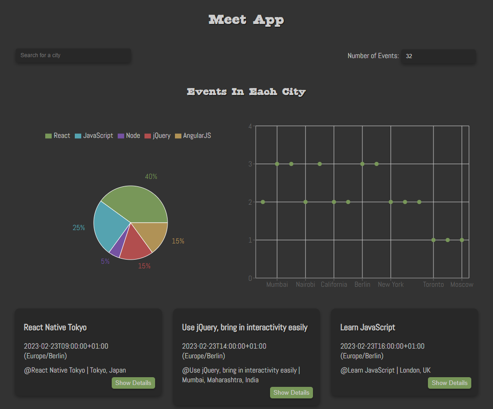

# Meet Application

## About

A serverless, progressive web application (PWA) built with React using a test-driven development (TDD) technique. The application uses the Google Calendar API to fetch upcoming events.

### Application Link

Meet App (https://mpschirle1.github.io/meet/)

## Key Features

- Filter events by city.
- Show/hide event details.
- Specify number of events.
- Use the app when offline.
- Add an app shortcut to the home screen.
- View a chart showing the number of upcoming events by city.

## Dependencies

<pre>
"@testing-library/jest-dom": "^4.2.4",
"@testing-library/react": "^9.5.0",
"@testing-library/user-event": "^7.2.1",
"atatus-spa": "^4.5.0",
"axios": "^0.27.2",
"nprogress": "^0.2.0",
"react": "^16.13.1",
"react-dom": "^16.13.1",
"react-scripts": "3.4.1",
"recharts": "^1.8.6",
"web-vitals": "^2.1.4",
"workbox-background-sync": "^6.5.4",
"workbox-broadcast-update": "^6.5.4",
"workbox-cacheable-response": "^6.5.4",
"workbox-core": "^6.5.4",
"workbox-expiration": "^6.5.4",
"workbox-google-analytics": "^6.5.4",
"workbox-navigation-preload": "^6.5.4",
"workbox-precaching": "^6.5.4",
"workbox-range-requests": "^6.5.4",
"workbox-routing": "^6.5.4",
"workbox-strategies": "^6.5.4",
"workbox-streams": "^6.5.4"
</pre>

#### Dev Dependencies

<pre>
"enzyme": "^3.11.0",
"enzyme-adapter-react-16": "^1.15.7",
"jest-cucumber": "^3.0.0",
"prettier": "^2.8.1",
"puppeteer": "^3.3.0"
</pre>
